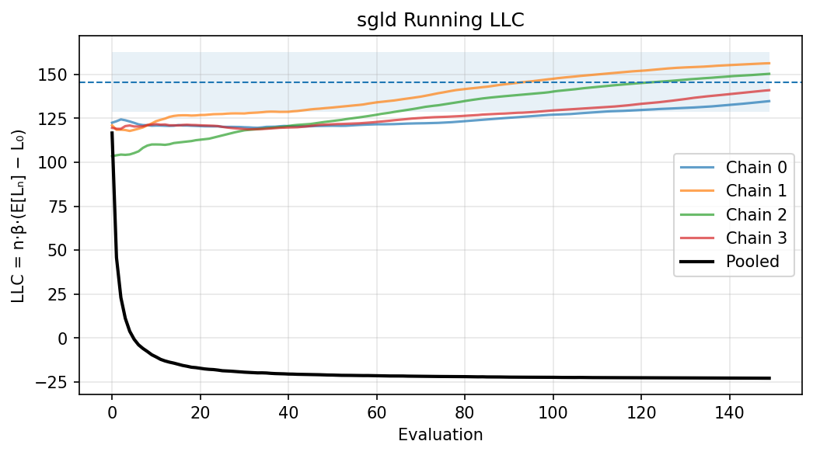
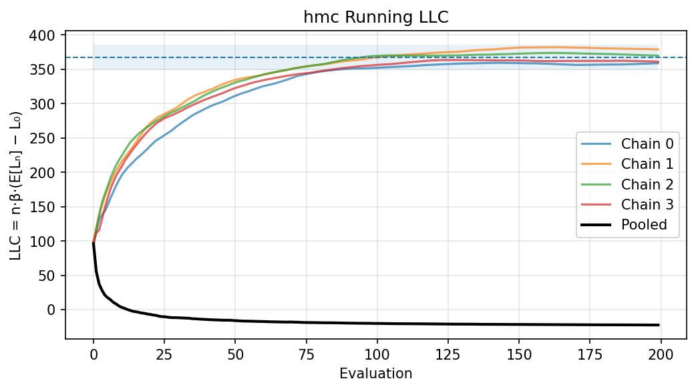
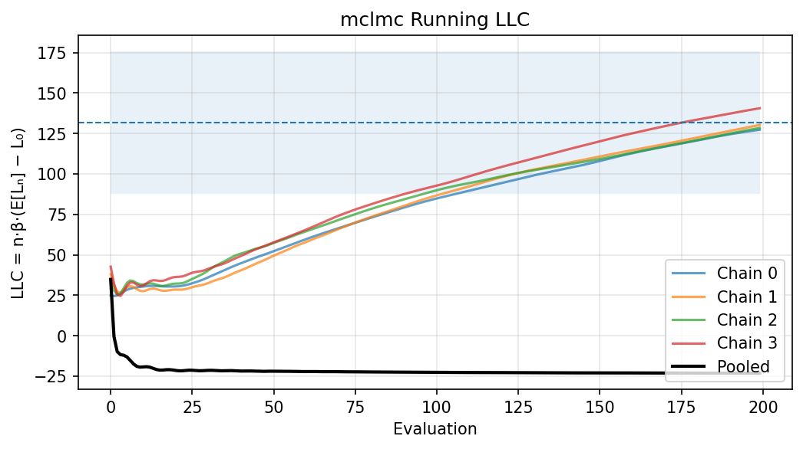

# Local Learning Coefficient Sampler Benchmarks

In [Singular Learning Theory (SLT)](https://singularlearningtheory.com), the **Local Learning Coefficient (LLC)** quantifies the effective local dimensionality of a model around a trained optimum.

This repo provides benchmark estimators of LLC on small but non-trivial neural networks, using standard industrial tooling: [BlackJAX](https://github.com/blackjax-devs/blackjax/tree/1.2.5) for sampling and [ArviZ](https://python.arviz.org/) for diagnostics.

---

## Prerequisites

* **Python versions**

  * **SLURM/submitit:** Python **3.12** (cluster standard, at least on our cluster)
  * **Modal:** Python **3.11** (baked into the Modal image)
  * **Local:** Prefer **3.12** for parity with SLURM; 3.11 also works

* **Package manager:** [uv](https://github.com/astral-sh/uv)

---

## Quick Start (CPU example)

1. Create an environment:

   ```bash
   uv venv --python 3.12 && source .venv/bin/activate
   uv sync --extra cpu
   ```

2. Run a small experiment:

   ```bash
   uv run llc run --sampler sgld --preset=quick
   ```

3. Analyze the run:

   ```bash
   uv run llc analyze runs/<run_id> --which all --plots running_llc,rank,ess_evolution,autocorr,energy,theta
   ```

This generates diagnostic plots such as:





---

## Interpreting Plots

* **Running LLC:** curves should stabilize and agree across chains; divergence = poor mixing.
* **Rank plots:** near-uniform → good; spikes → multimodality/non-convergence.
* **ESS evolution:** should grow and plateau; flat growth → high autocorrelation.
* **Energy (HMC/MCLMC):** distributions should look regular/tight.

More plots are available via `llc analyze` (rank, ESS, autocorrelation, theta traces, energy histograms).

---

## Running on Different Backends

All backends share the same flags (`--backend`, `--gpu-mode`, `--gpu-types`) via a unified executor.

### Local

```bash
uv sync --extra cpu
uv run llc run --backend=local --sampler sgld --preset=quick
```

### SLURM (Python 3.12 + CUDA 12)

```bash
uv venv --python 3.12 && source .venv/bin/activate
uv sync --extra slurm --extra cuda12
uv run llc run --backend=submitit --gpu-mode=vectorized \
  --slurm-partition=gpu --account=abc123 --sampler sghmc
```

### Modal (Python 3.11 inside image)

```bash
uv sync --extra modal
uv run llc run --backend=modal --gpu-mode=vectorized --sampler sghmc
```

See [docs/backends.md](docs/backends.md) for full setup (Modal + SLURM).

---

## Common Tasks

| Task                    | Command                                                                                   |
| ----------------------- | ----------------------------------------------------------------------------------------- |
| Single SGHMC run        | `uv run llc run --sampler sghmc --preset=quick`                                           |
| Local sweep (8 workers) | `uv run llc sweep --workers=8`                                                            |
| Sweep with study YAML   | `uv run llc sweep --study study.yaml --backend=modal`                                     |
| Sweep samplers (JSON)   | `uv run llc sweep --sampler-grid='[{"name":"sgld","overrides":{"sgld_precond":"adam"}}]'` |
| SLURM sweep             | `uv run llc sweep --backend=submitit --gpu-mode=vectorized`                               |
| Modal sweep             | `uv run llc sweep --backend=modal`                                                        |
| Analyze saved run       | `uv run llc analyze runs/<run_id>`                                                        |
| Plot sweep results      | `uv run llc plot-sweep`                                                                   |
| Refresh README images   | `uv run llc promote-readme-images`                                                        |

---

## Concepts

* **Job** = (problem, sampler, seed)
* **Family** = jobs sharing (problem, seed) but differing by sampler
* **Sweep** = many jobs + one CSV summary (`llc_sweep_results.csv`)

Sweeps always run one sampler per job.
Attempts are made to cache identical jobs to avoid wating compute.

---

## What’s in a Run

```text
runs/<run_id>/
├── config.json          # full configuration
├── metrics.json         # summary statistics (LLC mean/SE, ESS, WNV, timings)
├── L0.txt               # baseline loss at ERM
├── sgld.nc              # ArviZ traces for SGLD
├── sghmc.nc             # ArviZ traces for SGHMC
├── hmc.nc               # traces + acceptance + energies for HMC
├── mclmc.nc             # traces + energy deltas for MCLMC
└── analysis/            # generated by `llc analyze`
    ├── *_running_llc.png
    ├── *_rank.png
    └── ...
```

**Sample `metrics.json`:**

```json
{
  "sgld_llc_mean": 145.7,
  "sghmc_llc_mean": 142.3,
  "sghmc_llc_se": 8.15,
  "hmc_llc_mean": 367.1,
  "hmc_llc_se": 9.27,
  "hmc_ess": 28.0,
  "hmc_wnv_time": 0.042,
  "hmc_timing_sampling": 12.83,
  "mclmc_llc_mean": 131.7
}
```

---

## Defining Sweeps

### YAML Study Files

```yaml
# study.yaml
base:
  preset: quick
problems:
  - name: small
    overrides: {target_params: 2000}
  - name: large
    overrides: {target_params: 10000}
samplers:
  - name: sgld
    overrides: {sgld_precond: none}
  - name: sgld
    overrides: {sgld_precond: adam}
  - name: hmc
    overrides: {hmc_num_integration_steps: 10}
seeds: [0,1,2]
```

Run:

```bash
uv run llc sweep --backend=modal --study study.yaml
```

### JSON Grid Sweeps

```bash
uv run llc sweep --sampler-grid='[{"name":"sgld","overrides":{"sgld_precond":"adam"}}]'
```

---

## Efficiency Metrics (Advanced)

From saved traces we compute:

* **ESS/sec** — effective samples per second
* **ESS/FDE** — effective samples per full-data-equivalent gradient
* **WNV (time/FDE)** — variance × cost for fair comparison

Results are saved to `metrics.json` per run and `llc_sweep_results.csv` for sweeps.

---

## Installation

```bash
uv sync
uv sync --extra modal      # Modal support
uv sync --extra slurm      # SLURM support
```

---

## Features

* Unified CLI for end-to-end LLC estimation
* Consistent sampler interface: SGLD, SGHMC, HMC, MCLMC
* Three execution backends: Local, SLURM, Modal
* Configurable targets: ReLU/tanh/GeLU MLPs, analytical quadratic
* Full ArviZ diagnostics (ESS, R̂, autocorrelation, rank plots)
* Deterministic caching (reuses runs by config+code hash)

---

## Documentation

* [Backends (Modal/SLURM setup)](docs/backends.md)
* [Caching behavior](docs/caching.md)
* [Preconditioned SGLD options](docs/sgld-precond.md)
* [Target functions and data generators](docs/targets.md)
* [BlackJAX API notes](docs/blackjax.md)

---

## License

MIT.
