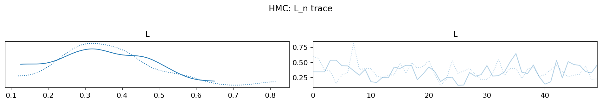
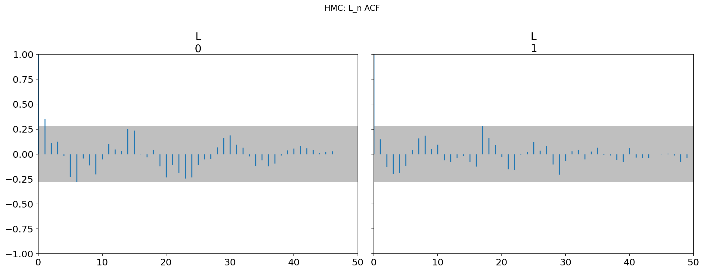
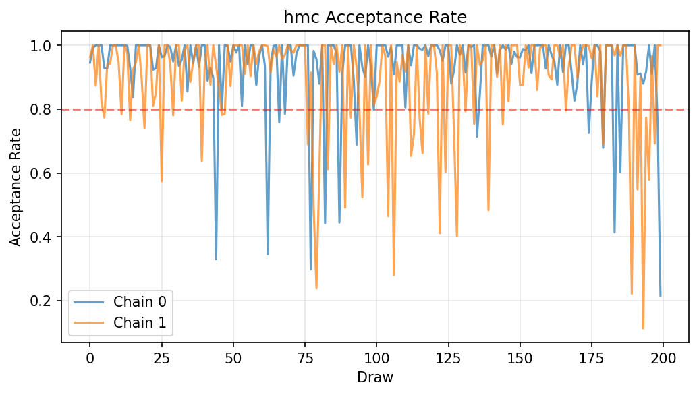
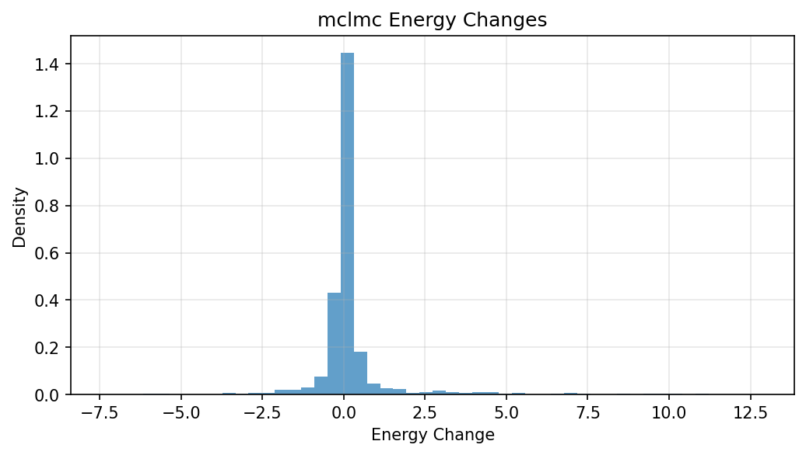

# Local Learning Coefficient Sampler Benchmarks

This repo contains code to*estimate _Local Learning Coefficients (LLCs)_ for small neural networks using _stochastic gradient Langevin dynamics (SGLD)_, _Hamiltonian Monte Carlo (HMC)_, and _Microcanonical Langevin Monte Carlo (MCLMC)_, all implemented via [BlackJAX](https://github.com/blackjax-devs/blackjax/tree/1.2.5).

---

## Motivation

In [Singular Learning Theory (SLT)](https://singularlearningtheory.com), the _Local Learning Coefficient (LLC)_ quantifies the *effective local dimensionality* of a model around a trained optimum. The LLC is crucial for understanding the geometry of singular loss surfaces, which differ fundamentally from the quadratic approximations that standard Bayesian Laplace methods assume.
The recent [*From Global to Local: A Scalable Benchmark for Local Posterior Sampling* (Hitchcock & Hoogland, 2024)](file-9pNmXEB8xGTwKS1evcvu5F) uses _deep linear networks (DLNs)_ as ground truth, because those admit analytic LLC values.

We might fail to be persuaded by those;
linear nets are a very special case.
Our research agenda is to see how well SGLD (and alternative SGMCMC methods) track local geometry in *nonlinear* models (ReLU, GeLU, etc.) where analytic LLCs aren’t available.
To do that responsibly, we first need to ground-truth against a sampler we trust (HMC) on small models with ~10k parameters — large enough to show interesting degeneracies, but still small enough that HMC is (barely) feasible.

Ultimately, we want to devise and evaluate new sampling algorithms for singular neural nets. This repo is the foundation: it gives us side-by-side SGLD, HMC, and MCLMC runs with consistent LLC estimation and diagnostics.

## What’s inside

- `main.py` — end-to-end pipeline:

  - Small but non-trivial MLP model with configurable depth, widths, activation (ReLU, tanh, GeLU, identity for deep-linear).
  - Teacher–student data generator with parametric input distributions (isotropic Gaussian, anisotropic, mixture of Gaussians, low-dim manifolds, heavy-tailed).
  - Noise models: Gaussian, heteroscedastic, Student-t, outliers.
  - ERM training (i.e. SGD) to locate the empirical minimizer \(w^\*\); the local Gaussian prior is centered at \(w^\*\).
  - Tempered local posterior (\(\beta = \beta_0/\log n\) by default) + Gaussian localization (\(\gamma = d / r^2\) if `prior_radius` given), which is the standard way of “doing LLC”.
  - **Online LLC estimator** computed during sampling, using occasional full-batch loss evaluations.
  - **Samplers**:
    - **SGLD** (unadjusted stochastic gradient Langevin dynamics, with minibatching, online LLC evaluation, optional RMSProp/Adam preconditioning).
    - **HMC** (full-batch, with BlackJAX `window_adaptation` to tune step size + diagonal mass).
    - **MCLMC** (microcanonical Langevin Monte Carlo, unadjusted, with automatic tuning of step size and momentum decoherence length `L` using [the official BlackJAX tuner](https://blackjax-devs.github.io/sampling-book/algorithms/mclmc.html)).
  - **Diagnostics via [ArviZ](https://python.arviz.org/):**
    - Running \(\hat\lambda_t\) (per-chain + pooled).
    - Trace, autocorrelation, ESS, and \(\hat R\) for \(L_n(w)\).
    - Optional trace/rank plots for a tiny subset or random projection of θ (memory-safe).
    - HMC acceptance-rate histogram; MCLMC energy-change histogram.
  - **Work-normalized variance (WNV)** metrics: variance of LLC estimate × (wall-clock time or gradient-equivalent count).

## Examples

These are examples from a recent run.

### Running LLC Estimates


*SGLD: Running Local Learning Coefficient estimates showing convergence over sampling iterations*


*HMC: Running LLC estimates with multiple chains and pooled estimate*


*MCLMC: Running LLC estimates showing sampling efficiency*

### MCMC Diagnostics


*HMC: Trace plots of loss function values L_n across chains*


*HMC: Autocorrelation function for L_n showing mixing properties*


*HMC: Acceptance rate distribution across chains*


*MCLMC: Energy change distribution showing microcanonical dynamics*

---

## Installation

We use [uv](https://docs.astral.sh/uv/) for dependency management:

```bash
uv sync
```


For distributed computing, install the appropriate backend:

```bash
uv sync --extra slurm      # SLURM/submitit support
uv sync --extra modal      # Modal serverless support
uv sync --all-extras       # Both backends
```

Or with pip:
```bash
pip install llc[slurm]     # SLURM support
pip install llc[modal]     # Modal support
```

---

## Caching & Skipping

Each run is keyed by a hash of (normalized config, code fingerprint).

**Code fingerprint:**
- If `LLC_CODE_VERSION` is set in environment → use it
- Otherwise → hash of all source files (`llc/**/*.py` + `pyproject.toml`)

**Default behavior:** Skip if a run with the same key already exists.

**Force recompute:** Add `--no-skip`

```bash
# Normal run (uses cache if available)
uv run python main.py run --preset=quick

# Force re-run even if cached
uv run python main.py run --preset=quick --no-skip

# Override code version (for CI/Modal deployments)
LLC_CODE_VERSION=deploy-123 uv run python main.py run
```

**Tips:**
- Editing any `llc/*.py` file changes the fingerprint automatically
- On Modal/CI, set `LLC_CODE_VERSION` to a build ID if you want explicit control
- The cache works everywhere (local, Modal, SLURM) with the same logic


---

## Preconditioned SGLD (Optional)

You can optionally enable diagonal preconditioning for SGLD to improve practical efficiency:

```bash
# RMSProp/pSGLD-style
uv run python main.py run --sgld-precond=rmsprop --sgld-beta2=0.999 --sgld-eps=1e-8

# Adam-preconditioned SGLD
uv run python main.py run --sgld-precond=adam --sgld-beta1=0.9 --sgld-beta2=0.999 \
  --sgld-eps=1e-8 --sgld-bias-correction
```

These adaptive SGMCMC variants are heuristics: the per-parameter scale changes during sampling,
so the chain is not strictly stationary for the target at all times.
They are widely used in practice and often yield better mixing than non-adaptive versions.
Set `--sgld-precond=none`if you prefer the plain kernel.

**Configuration options:**

- `--sgld-precond`: Choose `none` (default), `rmsprop`, or `adam`
- `--sgld-beta1`: Adam first-moment decay (default: 0.9)
- `--sgld-beta2`: RMSProp/Adam second-moment decay (default: 0.999)
- `--sgld-eps`: Numerical stabilizer (default: 1e-8)
- `--sgld-bias-correction` / `--no-sgld-bias-correction`: Adam bias correction (default: on)

---

## Visualization and Artifact Management

The system includes comprehensive visualization saving capabilities for systematic analysis and documentation:

### Automatic Run Organization

- **Timestamped Directories**: Each run creates `artifacts/YYYYMMDD-HHMMSS/` directories
- **Deterministic Naming**: Plots use consistent `<sampler>_<plotname>.png` format
- **Run Manifest**: `manifest.txt` contains complete configuration and runtime statistics
- **Documentation**: `README_snippet.md` provides formatted run summaries

### Saved Diagnostic Plots

For each sampler (SGLD, HMC, MCLMC), the system saves:

- `*_llc_running.png` - Running LLC estimates over time
- `*_L_trace.png` - Trace plots of loss function values
- `*_L_acf.png` - Autocorrelation function plots
- `*_L_ess.png` - Effective sample size plots
- `*_L_rhat.png` - R-hat convergence diagnostics
- `*_theta_trace.png` - Parameter trace plots (subset)
- `*_theta_rank.png` - Rank plots for parameters

Additional sampler-specific plots:
- `hmc_acceptance.png` - HMC acceptance rate histogram
- `mclmc_energy_hist.png` - MCLMC energy change distribution

### Configuration Options

Control visualization and artifact saving via CLI flags:

```bash
# Save artifacts with plots (default behavior)
uv run python main.py run --preset=quick

# Run without saving artifacts (faster)
uv run python main.py run --preset=quick --no-artifacts

# Force re-run even if cached results exist
uv run python main.py run --preset=quick --no-skip
```

### Common Tasks

Below are copy-paste commands for typical workflows:

#### Local quick runs
```bash
# Fastest smoke test (no artifacts)
uv run python main.py run --preset=quick --no-artifacts

# Quick with artifacts (plots, NetCDF, manifest, gallery)
uv run python main.py run --preset=quick
```

#### Remote single runs
```bash
# Run one job on Modal
uv run python main.py run --backend=modal --preset=quick

# Run one job on SLURM
uv run python main.py run --backend=submitit --preset=quick
```

#### Full run
```bash
uv run python main.py run --preset=full
```

#### Parameter sweep (local CPU)
```bash
# Serial execution
uv run python main.py sweep

# Parallel on N local workers
uv run python main.py sweep --backend=local --workers=8
```

#### Modal (serverless) — deploy once, then sweep
```bash
# 1) Deploy the app
uv run modal deploy modal_app.py

# 2) Run a tiny validation job (cheap test)
python - <<'PY'
import modal
fn = modal.Function.from_name("llc-experiments","run_experiment_remote")
print(fn.remote({"preset":"quick","save_artifacts":True}))
PY

# 3) Sweep on Modal (use small n-seeds while testing)
uv run python main.py sweep --backend=modal --n-seeds=1 --preset=quick
```

#### SLURM (Submitit)
```bash
uv run python main.py sweep --backend=submitit  # add your submitit params if needed
```

#### Development utilities
```bash
# Clean generated artifacts
rm -rf artifacts/* llc_sweep_results.csv __pycache__ *.pyc

# Promote plots for README
uv run python scripts/promote_readme_images.py
```

## Refreshing README figures

We keep a few diagnostic plots in `assets/readme/` for illustration.

### Local run (fastest on your machine)

```bash
uv run python main.py run --preset=quick
uv run python scripts/promote_readme_images.py
git add assets/readme
git commit -m "refresh README examples"
```

### Remote run on Modal (one cheap job)

```bash
# 1) run once on Modal - artifacts are automatically downloaded to ./artifacts/<run_id>/
uv run python main.py run --backend=modal --preset=quick

# 2) promote images as usual
uv run python scripts/promote_readme_images.py
git add assets/readme
git commit -m "refresh README examples"
```


Notes:

* The Modal volume name is `llc-artifacts` (see Makefile targets `modal-ls`, `modal-get`).
* The pipeline writes artifacts under `artifacts/<run_id>` locally, and `/artifacts/<run_id>` on Modal; the README promoter already selects the **latest** local run automatically.
* Use `--no-skip` if you need to force recompute; by default identical config+code uses the cached run (see the caching logic driven by `run_id(cfg)` in `llc/cache.py`).


## Usage

### Run a single experiment

```bash
uv run python main.py
```

* Uses the default `Config` (`in_dim=32`, `target_params≈10k`, ReLU MLP).
* Trains to ERM, centers prior at $w^\*$, runs **SGLD** then **HMC** then **MCLMC**.
* Prints LLC estimates, ESS/$\hat R$, acceptance stats, WNV.
* Shows ArviZ convergence plots (trace, autocorr, ESS, R̂) plus running LLC curves.

### Run a sweep

```bash
uv run python main.py sweep
```

* Iterates over depth/width/activation/data/noise settings (see `sweep_space()`),
* logs per-run LLC results and saves to `llc_sweep_results.csv`.

## Parallelism

**Local (default):**

```bash
uv run python main.py sweep --backend=local --workers=4
```

**SLURM cluster:**

```bash
uv run python main.py sweep --backend=submitit \
  --partition=gpu --gpus=1 --timeout-min=60
```

**Modal serverless:**

```bash
uv run python main.py sweep --backend=modal
```

Artifacts are saved by default and automatically downloaded to `./artifacts/<run_id>/` as each job completes. Use `--no-artifacts` to disable saving.

### Modal (deployed app) workflow

We use a **deployed Modal app** for sweeps.
That means we deploy once, then the local client looks up the remote function by name and maps work to it.

**Note:** We install Modal via `uv`. Run Modal CLI commands as `uv run modal ...`
(e.g., `uv run modal deploy modal_app.py`, `uv run modal volume ls llc-artifacts`).

**One-time setup**
```bash
uv run modal token new                      # authenticate
uv run modal volume create llc-artifacts    # optional; code can create it on first run
uv run modal deploy modal_app.py            # build & register "llc-experiments/run_experiment_remote"
```

`modal_app.py` defines resources/timeouts/volumes on the decorator:

```python
app = modal.App("llc-experiments", image=image)

@app.function(
    timeout=3*60*60,  # generous 3 hours
    volumes={"/artifacts": artifacts_volume},
    retries=modal.Retries(max_retries=3, backoff_coefficient=2.0, initial_delay=10.0)
)
def run_experiment_remote(cfg_dict: dict) -> dict:
    ...
```

**Run a sweep (client)**

```bash
uv run python main.py sweep --backend=modal
```

The client looks up the deployed function by name and calls `.map(...)`. Artifacts are saved to the **Modal volume** mounted at `/artifacts` in the app.

**When to redeploy**

* Change to `modal_app.py` (decorators, image, function body) → redeploy
* Change to dependencies in `pyproject.toml` → redeploy
* Change to repo code that should run remotely (we ship local source in the image) → redeploy

Changes to local-only paths (like README) don't require redeploy.

**Tear down / clean up**

* Remove old run folders from the volume (optional housekeeping):
  `uv run modal volume rm llc-artifacts /artifacts/<run-id>`
* Stop the app (rare): `uv run modal app stop llc-experiments`

#### Modal artifacts

**Automatic download**: When you run `main.py run/sweep --backend=modal`, artifacts are automatically downloaded to `./artifacts/<run_id>/` as each job completes. No separate pull step needed!

**Manual retrieval** (if needed): For browsing or recovering old runs from the Modal volume:

#### Modal troubleshooting

* **Hydration error:** "Function has not been hydrated…" → you forgot to deploy, or you tried to import the decorated function directly instead of looking it up by name. Fix: `uv run modal deploy modal_app.py`, and have the client use `modal.Function.from_name("llc-experiments", "run_experiment_remote")`.
* **Timeouts not taking effect:** Remember timeouts are set in the decorator in `modal_app.py` (we use generous defaults), not per-call flags.
* **Artifacts missing locally:** Fetch from the volume with the `modal volume get` commands above.

---

## Roadmap

* **Preconditioned SGLD**: RMSProp-SGLD / Adam-SGLD.
* **Adjusted MCLMC**: MH-corrected variant with adaptive step-size (target accept ≈0.9).
* **Trans-dimensional moves**: exploring SLT’s *blow-ups* and richer sampler designs.
* **Scaling studies**: push toward larger ReLU/GELU networks, beyond HMC’s limit, to stress-test SGLD/MCLMC.
* **Better LLC error estimation**: block bootstrap on $L_n$ traces, multi-chain variance combination.

---

## Notes on BlackJAX API (v1.2.5)

To prevent confusion across docs vs release:

* **SGLD**

  * Public API: `sgld = blackjax.sgld(grad_fn)`
  * Step signature: `new_position = sgld.step(rng_key, position, minibatch, step_size)`
  * Source: [sgld.py (1.2.5)](https://github.com/blackjax-devs/blackjax/blob/1.2.5/blackjax/sgmcmc/sgld.py#L38-L47)
    (see `step_fn` → returns `kernel(...)` → returns `new_position`).

* **HMC**

  * Use `blackjax.hmc` with `blackjax.window_adaptation`.
  * `HMCInfo` fields include `acceptance_rate` (flat attribute).
  * Source: [hmc.py (1.2.5)](https://github.com/blackjax-devs/blackjax/blob/1.2.5/blackjax/mcmc/hmc.py#L330-L334).

* **MCLMC**

  * See [Sampling Book MCLMC example](https://blackjax-devs.github.io/sampling-book/algorithms/mclmc.html).
  * Tune `(L, step_size)` with `blackjax.mclmc_find_L_and_step_size`, then build `blackjax.mclmc(logdensity_fn, L, step_size)`.
  * Integrators available in [integrators module (1.2.5)](https://github.com/blackjax-devs/blackjax/tree/1.2.5/blackjax/mcmc/integrators) (e.g. `isokinetic_mclachlan`).
  * `MCLMCInfo` has `energy_change` field (see [mclmc.py (1.2.5)](https://github.com/blackjax-devs/blackjax/blob/1.2.5/blackjax/mcmc/mclmc.py)).

⚠️ **Docs drift warning**: the online blackjax docs default to `main`.
They may show `acceptance_probability` for HMC or a different SGLD step signature. Always cross-check the [1.2.5 tag source](https://github.com/blackjax-devs/blackjax/tree/1.2.5) when in doubt.

---

## License

MIT.
