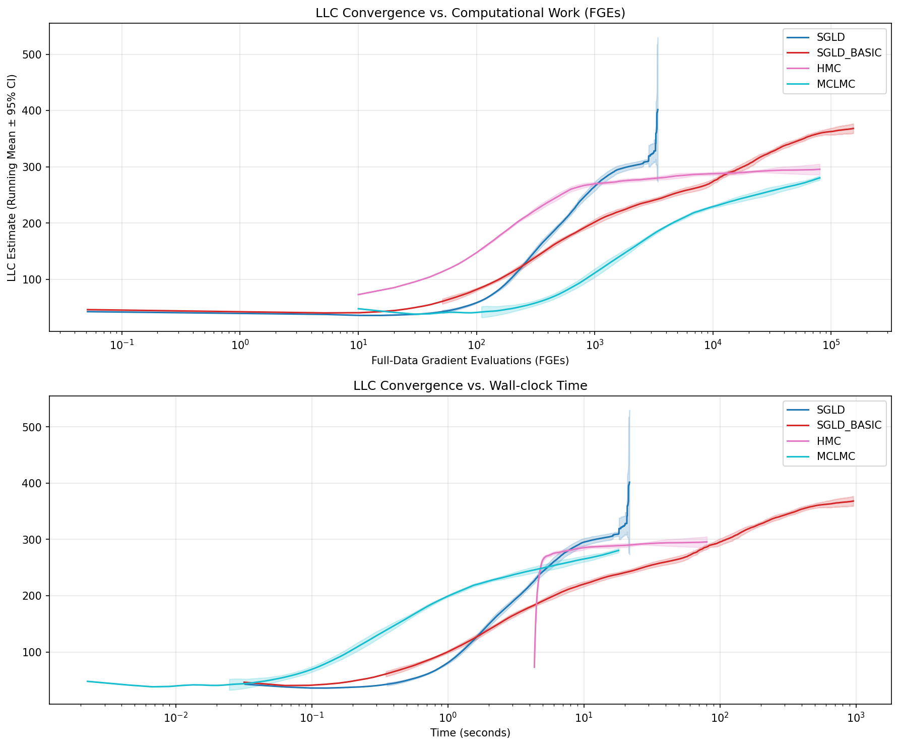

# Lambda-Hat (λ̂): Experiments in estimating the Local Learning Coefficient

In [Singular Learning Theory (SLT)](https://singularlearningtheory.com), the **Local Learning Coefficient (LLC)** quantifies the effective local dimension of a model around a trained optimum.

We target networks with parameter-space dimension up to about $10^5$ which means we can ground-truth against classic samplers like HMC (which we expect to become non-viable as either dimension or cardinality of the dataset increases).
In this regime we can rely upon classic MCMC to tell us the “true” LLC rather than relying on analytic results for approximate networks such as Deep Linear Networks.

## Concept

The Local Learning Coefficient (LLC) measures the effective number of parameters a neural network *actually* learns from data. Lambda-Hat implements a teacher–student framework with a four-stage design:

* **Stage A**: Build and train a neural network target once, generating a reproducible **target artifact**.
* **Stage B**: Run multiple samplers (MCMC or variational) on the same target with different configurations (fast mode: no diagnostics).
* **Stage C**: Generate offline diagnostics from traces (optional, separate from sampling for speed).
* **Stage D**: Promote results to galleries and aggregated reports (optional, opt-in via `--promote`).

This separation provides:

* **Reproducibility**: Same target ID = identical neural network weights and data
* **Efficiency**: Train expensive targets once, sample many times, generate diagnostics only when needed
* **Isolation**: Target configuration, sampler hyper-parameters, and diagnostic generation are decoupled
* **Cost control**: Resource-intensive target building, fast sampling, and optional expensive diagnostics can be optimized independently

In [Singular Learning Theory (SLT)](https://singularlearningtheory.com), the **Local Learning Coefficient (LLC)** quantifies the effective local dimension of a model around a trained optimum.
Estimating it can be tricky. That is what we explore here.




* [[2308.12108] The Local Learning Coefficient: A Singularity-Aware Complexity Measure](https://arxiv.org/abs/2308.12108)
* [[2507.21449] From Global to Local: A Scalable Benchmark for Local Posterior Sampling](https://arxiv.org/abs/2507.21449)
* [singularlearningtheory.com](https://singularlearningtheory.com/)


This repo provides benchmark estimators of LLC on small but non-trivial neural networks, using standard industrial tooling:

* [BlackJAX](https://github.com/blackjax-devs/blackjax/tree/1.2.5) for MCMC sampling (HMC, MCLMC, SGLD)
* [ArviZ](https://python.arviz.org/) for diagnostics
* [OmegaConf](https://omegaconf.readthedocs.io/) for configuration management
* [Haiku](https://github.com/haiku/haiku) for neural network definitions

**Supported samplers**: HMC, MCLMC, SGLD, VI (variational inference with MFA or Flow algorithms).
**Note**: Flow VI requires `uv sync --extra flowvi`. See [Flow VI documentation](./docs/vi_flow.md) for JAX/vmap PRNG guidance and current status.

We target networks with dimension up to about $10^5$ which means we can ground-truth against classic samplers like HMC (which we expect to become non-viable in higher dimension or dataset size).
In this regime we can rely upon classic MCMC to tell us the "true" LLC rather than relying on analytic results for approximate networks such as Deep Linear Networks.

## Installation

Requires Python 3.11+.

```bash
# Using uv (recommended):
uv venv --python 3.12 && source .venv/bin/activate
uv sync --extra cpu      # For CPU/macOS (Detects architecture and installs older JAX for x86 macs)
uv sync --extra cuda12   # For CUDA 12 (Linux)

# Or using pip:
pip install .[cpu]       # For CPU/macOS
pip install .[cuda12]    # For CUDA 12 (Linux)
```

---


## Quick start

Run the Smoke test: all samplers on a tiny problem

```bash
uv run lambda-hat workflow sample \
  --config config/experiments_smoke.yaml \
  --backend local
```

This runs all configured samplers on a single small problem
(`experiment=smoke_all_samplers`) and is suitable for CI or pre-commit
smoke testing.

Optional quick diagnostics:

```bash
# Check that sampling processes produced sensible outputs
uv run lambda-hat diagnose-experiment \
  --experiment smoke_all_samplers \
  --mode light

# Compares trained target (student) to generating model (teacher)
uv run lambda-hat diagnose-targets \
  --experiment smoke_all_samplers
```
**Note:** At present running the sample workflow above does not specify a teacher, so the `diagnose-target` command will return a failure message like:

```bash
[timestamp] INFO lambda_hat.commands.diagnose_target_cmd: [diagnose-targets] Processing 1 targets in experiment 'smoke_all_samplers'
[timestamp] INFO lambda_hat.commands.diagnose_target_cmd: [diagnose-targets] [1/1] target_id
[timestamp] INFO lambda_hat.commands.diagnose_target_cmd: [diagnose-target] Processing target: target_id
[timestamp] WARNING lambda_hat.commands.diagnose_target_cmd: [diagnose-targets] [1/1] FAILED: target_id - Target target_id has no teacher (teacher: _null) - cannot generate teacher diagnostics
[timestamp] INFO lambda_hat.commands.diagnose_target_cmd: [diagnose-targets] ✓ Completed: 0 success, 1 failed out of 1 targets
✓ Processed 1 targets: 0 success, 1 failed
Failed targets:
  • target_id
```
with `timestamp` a time and `target_id` a 12-long hexadecimal string.


## Entrypoints

Lambda-Hat provides command-line tools that implement the four-stage workflow.
Parsl orchestrates these automatically, but they can also be invoked directly for debugging or custom workflows.

### `lambda-hat build` (Stage A)

Builds a neural network target artifact: trains a model, saves parameters, data, and metadata.

```bash
uv run lambda-hat build \
  --config-yaml config/composed.yaml \
  --target-id tgt_abc123 \
  --experiment my_experiment
```

**Outputs:**
- `meta.json` — config snapshot, dimensions, L0, package versions
- `params.npz` — trained neural network parameters
- `data.npz` — training dataset (X, Y)
- `diagnostics/` — teacher comparison plots (when teacher is configured and `LAMBDA_HAT_SKIP_DIAGNOSTICS=0`)
  - `target_train_test_loss.png` — training and test loss curves
  - `target_pred_vs_teacher_train.png` — student vs teacher predictions (train set)
  - `target_pred_vs_teacher_test.png` — student vs teacher predictions (test set)

**Key features:**
- Content-addressed target IDs ensure reproducibility
- Precision mode (`jax_enable_x64`) recorded in metadata
- Reference loss L0 computed and stored for LLC estimation
- Target diagnostics enabled by default for local builds, disabled for Parsl workflows (set `LAMBDA_HAT_SKIP_DIAGNOSTICS=0/1` to override)

**Regenerate target diagnostics:**
```bash
# Single target
uv run lambda-hat diagnose-target --target-id tgt_abc123 --experiment dev

# All targets in experiment
uv run lambda-hat diagnose-targets --experiment dev
```

### `lambda-hat sample` (Stage B)

Runs a sampler (MCMC or variational) on a pre-built target artifact.

```bash
uv run lambda-hat sample \
  --config-yaml config/sampler.yaml \
  --target-id tgt_abc123 \
  --experiment my_experiment
```

**Outputs:**
- `traces_raw.npz` — Raw trace data (NumPy compressed arrays: LLC samples, scalars)
- `manifest.json` — Run metadata (sampler config, timings, work metrics)

**Note:** Diagnostics (`trace.nc`, `analysis.json`, plots) are generated in Stage C via `lambda-hat diagnose`

**Key features:**
- Precision guard: fails if sampler x64 setting mismatches target
- Automatic minibatching for SGLD-family samplers
- Parallel chain execution with JAX's vmap
- Workers write raw traces only; diagnostics generated separately in Stage C

### `lambda-hat diagnose` (Stage C)

Generates offline diagnostics (plots and analysis) from completed sampling runs. This is decoupled from sampling for speed.

```bash
# Generate diagnostics for a single run
uv run lambda-hat diagnose \
  --run-dir artifacts/experiments/dev/runs/20251120... \
  --mode light

# Generate diagnostics for all runs in an experiment
uv run lambda-hat diagnose-experiment \
  --experiment dev \
  --mode light \
  --samplers sgld,hmc
```

**Outputs:**
- `diagnostics/trace.png` — ArviZ trace plots
- `diagnostics/rank.png` — Rank plots for convergence
- `diagnostics/energy.png` — Energy plots (HMC/MCLMC)
- `diagnostics/llc_convergence_combined.png` — LLC convergence plot
- `diagnostics/wnv.png` — Work-normalized variance (only in `--mode full`)

**Modes:**
- `light` (default) — Basic plots (trace, rank, energy, convergence)
- `full` — All plots including expensive work-normalized variance

### `lambda-hat promote` (Stages C-2 and D)

Creates galleries from diagnostic plots and copies them to **repository-visible locations** for documentation.

**Promotion writes to TWO locations:**
1. **Artifact system**: `artifacts/experiments/{exp}/artifacts/promotion/` (workflow-specific)
2. **Repository**: `docs/assets/{exp}/samplers/` and `docs/assets/{exp}/targets/` (browsable on GitHub)

**Manual promotion commands:**
```bash
# Create an asset gallery with newest run per sampler
uv run lambda-hat promote gallery \
  --runs-root artifacts/experiments/dev/runs \
  --samplers sgld,hmc,mclmc \
  --outdir artifacts/promotion \
  --snippet-out artifacts/promotion/gallery.md

# Copy specific plots
uv run lambda-hat promote single \
  --runs-root artifacts/experiments/dev/runs \
  --samplers sgld \
  --outdir figures \
  --plot-name llc_convergence_combined.png
```

**Automated promotion via workflow:**
```bash
# Run workflow with diagnostics and promotion
uv run lambda-hat workflow sample --backend local --promote

# Specify which plots to promote
uv run lambda-hat workflow sample --backend local --promote \
    --promote-plots trace.png,llc_convergence_combined.png
```

**How it works:**
- Without `--promote`: Runs Stages A + B only (fast, no diagnostics or plots)
- With `--promote`: Runs Stages A + B + C + C-2 + D:
  - **Stage C**: Generate diagnostics for all sampler runs
  - **Stage C-2**: Copy target diagnostics to `docs/assets/{exp}/targets/`
  - **Stage D**: Create galleries and copy to `docs/assets/{exp}/samplers/`

**Repository outputs** (`docs/assets/{experiment}/`):
- `samplers/*.png` — Latest sampler plots (hmc.png, vi.png, sgld.png, etc.)
- `samplers/gallery_*.md` — HTML gallery snippets for embedding
- `targets/{target_id}/diagnostics/*.png` — Target comparison plots


---

## Orchestration

We use **Parsl** for the full pipeline. Parsl provides Python-native DAG execution with better support for dynamic parameter sweeps and HPC cluster integration.

### Quickstart

```bash
# Run locally (uses single HTEX, multi-process)
uv run lambda-hat workflow sample --backend local

# Run locally with promotion (generates galleries)
uv run lambda-hat workflow sample --backend local --promote
```


### Editing experiments

* Edit `config/experiments.yaml` to add/remove targets and samplers.
* Parsl computes IDs and directories using the same logic; scripts do **not** invent paths.


### HPC Execution

For SLURM clusters, use the backend flag to select GPU or CPU execution:

```bash
# Run on SLURM GPU cluster
uv run lambda-hat workflow sample --backend slurm-gpu

# Run on SLURM CPU cluster with overrides
uv run lambda-hat workflow sample --backend slurm-cpu \
    --set walltime=04:00:00 --set max_blocks=300
```


## Artifact Layout

Lambda-Hat uses a **three-layer content-addressed artifact system** for reproducible experiments:

### 1. Content-Addressed Store (immutable)
```
artifacts/store/
└── objects/sha256/<hash>/
    ├── payload/                    # Actual artifact content
    │   ├── data.npz
    │   ├── params.eqx
    │   └── diagnostics/
    └── meta.json                   # Type, schema, provenance
```

### 2. Experiment Runs (symlinks to store)
```
artifacts/experiments/{experiment}/
├── targets/
│   └── {target_id} -> ../../../store/objects/sha256/.../
│       └── payload/
│           ├── meta.json
│           ├── data.npz
│           ├── params.npz
│           └── diagnostics/        # Target comparison plots
└── runs/
    └── {timestamp}-{sampler}-{tag}-{id}/
        ├── manifest.json           # Run metadata
        ├── traces_raw.npz          # Raw trace data (NumPy compressed)
        ├── trace.nc                # ArviZ trace (generated in Stage C)
        ├── analysis.json           # Metrics (generated in Stage C)
        └── diagnostics/            # Sampler diagnostics (generated in Stage C)
            ├── trace.png
            ├── rank.png
            └── llc_convergence_combined.png
```

### 3. Repository-Visible Assets (promotion outputs)
```
docs/assets/{experiment}/
├── samplers/
│   ├── hmc.png                     # Latest sampler plots
│   ├── vi.png
│   ├── sgld.png
│   └── gallery_*.md                # Gallery HTML snippets
└── targets/
    └── {target_id}/
        └── diagnostics/            # Target comparison plots
            ├── data.png
            └── loss.png
```

**Key features:**
- **Deduplication**: Identical targets stored once via content addressing
- **Reproducibility**: Same target ID = identical weights and data
- **Immutability**: Store objects never modified; experiments reference via symlinks
- **GitHub browsing**: Promoted assets in `docs/assets/` visible without artifact system access

See [`docs/output_management.md`](docs/output_management.md) for complete details on the artifact system.

### Hyperparameter Optimization

**NB** untested.

**Optuna workflow** for automated hyperparameter tuning using Bayesian optimization:

```bash
# Optimize hyperparameters locally
uv run lambda-hat workflow optuna --config config/optuna_demo.yaml --backend local

# Optimize on SLURM cluster
uv run lambda-hat workflow optuna --config config/optuna_demo.yaml \
    --backend slurm-cpu
```

**How it works:**
1. Computes HMC reference LLC for each problem (high-quality baseline)
2. Optimizes method hyperparameters (SGLD/VI/MCLMC) to minimize `|LLC - LLC_ref|`
3. Uses Optuna's TPE sampler for Bayesian search
4. Results written to `results/optuna_trials.parquet`

**Use cases:**
- Find optimal hyperparameters for your problem class
- Compare methods under fair time budgets
- Automate parameter tuning instead of manual sweeps

See [`docs/optuna_workflow.md`](docs/optuna_workflow.md) for detailed configuration and usage.

---

**Optuna workflow** (`lambda-hat workflow optuna`):
```
artifacts/
├── problems/
│   └── p_abc123/
│       └── ref.json                 # HMC reference LLC
└── runs/
    └── p_abc123/
        └── vi/
            ├── r_def456/            # one trial
            │   ├── manifest.json    # trial hyperparameters
            │   └── metrics.json     # trial results
            └── r_ghi789/

results/
├── optuna_trials.parquet            # all trials aggregated
└── studies/
    └── optuna_llc/
        └── p_abc123:vi.pkl          # Optuna study (for resume)
```

Artifacts are written to `runs/...` (default for `lambda-hat workflow sample`) or `artifacts/...` (default for `lambda-hat workflow optuna`). These paths are configurable via CLI arguments. The sampler name is included in folder names as a human-useful facet; all other hyperparameters live in `analysis.json` or `metrics.json`.

---

## Reproducibility & Precision

* **Same target ID** = identical data and parameters
* **Precision guard**: mismatch between target build (`jax_enable_x64`) and sampling run → error
* **Metadata**: package versions and code SHA recorded in `meta.json`
* **Parameter shape check**: ensures forward function matches stored parameters

### JAX precision conventions

* **Target building**: typically float64 for stability
* **SGLD**: float32 for efficiency
* **HMC/MCLMC**: float64 for accuracy

## Documentation

- [CLI Reference](./docs/cli.md) — All command-line options (auto-generated)
- [Configuration Reference](./docs/config.md) — YAML schema and defaults (auto-generated)
- [Experiments Guide](./docs/experiments.md) — How to compose experiments with overrides
- [Samplers](./docs/samplers.md) — HMC, MCLMC, SGLD, VI usage
- [Variational Inference](./docs/vi.md) — VI overview and shared concepts
- [Workflows](./docs/workflows.md) — Parsl orchestration, sweeps, artifact management
- [Compatibility](./docs/compatibility.md) — Version pins and API notes
- [Hyperparameter Optimization](./docs/optuna_workflow.md) — Optuna workflow guide
- [Methodology](./docs/methodology.md) — Conceptual background
- [Output Management](./docs/output_management.md) — Detailed artifact system
- [Contributing](./docs/CONTRIBUTING.md) — Documentation maintenance guide
