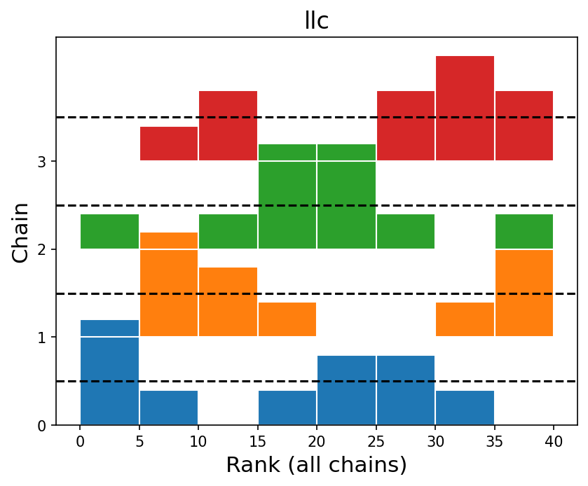
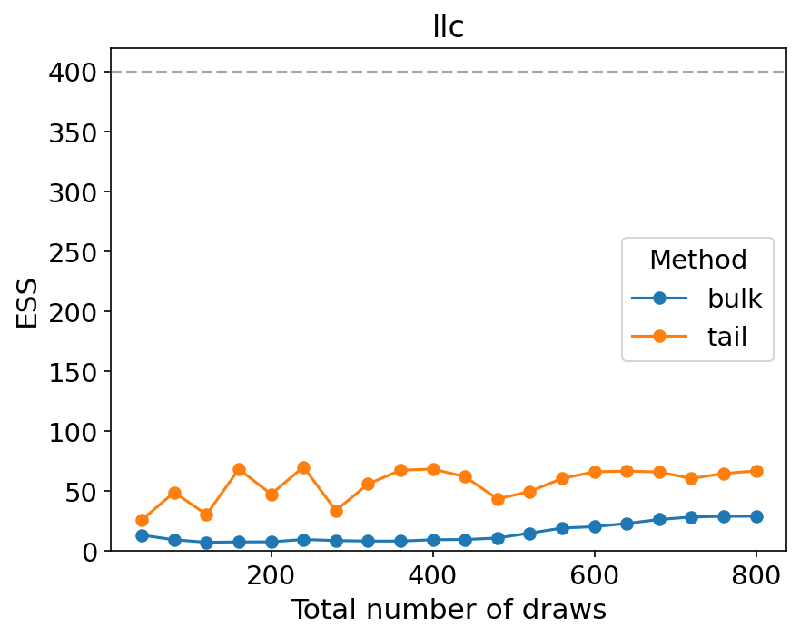
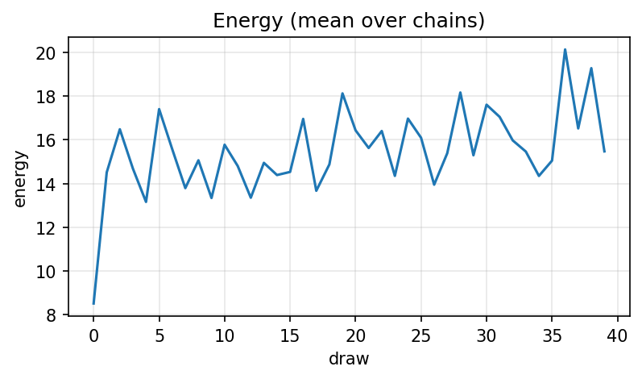
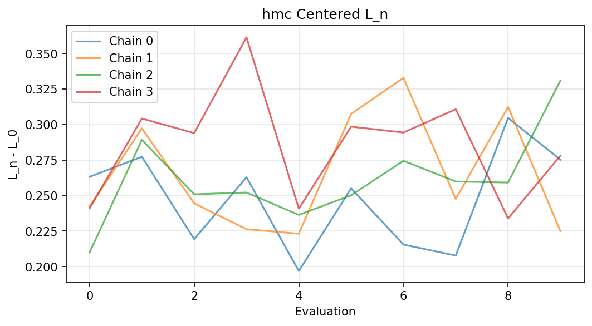

# Local Learning Coefficient Sampler Benchmarks

This repo contains code to*estimate _Local Learning Coefficients (LLCs)_ for small neural networks using _stochastic gradient Langevin dynamics (SGLD)_, _Hamiltonian Monte Carlo (HMC)_, and _Microcanonical Langevin Monte Carlo (MCLMC)_, all implemented via [BlackJAX](https://github.com/blackjax-devs/blackjax/tree/1.2.5).

---

## Motivation

In [Singular Learning Theory (SLT)](https://singularlearningtheory.com), the _Local Learning Coefficient (LLC)_ quantifies the *effective local dimensionality* of a model around a trained optimum. The LLC is crucial for understanding the geometry of singular loss surfaces, which differ fundamentally from the quadratic approximations that standard Bayesian Laplace methods assume.
The recent [*From Global to Local: A Scalable Benchmark for Local Posterior Sampling* (Hitchcock & Hoogland, 2024)](file-9pNmXEB8xGTwKS1evcvu5F) uses _deep linear networks (DLNs)_ as ground truth, because those admit analytic LLC values.

We might fail to be persuaded by those;
linear nets are a very special case.
Our research agenda is to see how well SGLD (and alternative SGMCMC methods) track local geometry in *nonlinear* models (ReLU, GeLU, etc.) where analytic LLCs aren’t available.
To do that responsibly, we first need to ground-truth against a sampler we trust (HMC) on small models with ~10k parameters — large enough to show interesting degeneracies, but still small enough that HMC is (barely) feasible.

Ultimately, we want to devise and evaluate new sampling algorithms for singular neural nets. This repo is the foundation: it gives us side-by-side SGLD, HMC, and MCLMC runs with consistent LLC estimation and diagnostics.

## What’s inside

- **Unified CLI** (`uv run python -m llc`) — end-to-end pipeline:

  - Small but non-trivial MLP model with configurable depth, widths, activation (ReLU, tanh, GeLU, identity for deep-linear).
  - Teacher–student data generator with parametric input distributions (isotropic Gaussian, anisotropic, mixture of Gaussians, low-dim manifolds, heavy-tailed).
  - Noise models: Gaussian, heteroscedastic, Student-t, outliers.
  - ERM training (i.e. SGD) to locate the empirical minimizer \(w^\*\); the local Gaussian prior is centered at \(w^\*\).
  - Tempered local posterior (\(\beta = \beta_0/\log n\) by default) + Gaussian localization (\(\gamma = d / r^2\) if `prior_radius` given), which is the standard way of “doing LLC”.
  - **Online LLC estimator** computed during sampling, using occasional full-batch loss evaluations.
  - **Samplers**:
    - **SGLD** (unadjusted stochastic gradient Langevin dynamics, with minibatching, online LLC evaluation, optional RMSProp/Adam preconditioning).
    - **HMC** (full-batch, with BlackJAX `window_adaptation` to tune step size + diagonal mass).
    - **MCLMC** (microcanonical Langevin Monte Carlo, unadjusted, with automatic tuning of step size and momentum decoherence length `L` using [the official BlackJAX tuner](https://blackjax-devs.github.io/sampling-book/algorithms/mclmc.html)).
  - **Diagnostics via [ArviZ](https://python.arviz.org/):**
    - Running \(\hat\lambda_t\) (per-chain + pooled).
    - Trace, autocorrelation, ESS, and \(\hat R\) for \(L_n(w)\).
    - Optional trace/rank plots for a tiny subset or random projection of θ (memory-safe).
    - HMC acceptance-rate histogram; MCLMC energy-change histogram.
  - **Work-normalized variance (WNV)** metrics: variance of LLC estimate × (wall-clock time or gradient-equivalent count). Automatically computed for all samplers to enable efficiency comparisons across parameter dimensions.
  - **Efficiency metrics** (per sampler):
    - `ESS/sec` — wall-clock efficiency
    - `ESS/FDE` — gradient-normalized efficiency (data-size-agnostic, where FDE = full-data-equivalent gradients)
    - `time_to_se1`, `fde_to_se1` — projected costs to reach SE(LLC)=1.0
  - **Post-hoc Analysis** (`llc analyze`) — pure, fast analysis on saved data:
    - Generates metrics and figures without re-running expensive sampling
    - Works on unified `.nc` files containing LLC traces, theta samples, acceptance rates, and energy
    - No JAX dependencies — runs instantly on any machine
    - Reproducible figure generation with custom themes/options

## Representative diagnostics

These examples come from a quick run with 4 chains (`--preset=quick`), using ArviZ for convergence diagnostics.

- **Running LLC (SGLD / HMC / MCLMC)** — per-chain and pooled running estimates of
  $\mathrm{LLC} = n\,\beta\,(E[L_n] - L_0)$. Horizontal band shows final mean ± 2·SE (ESS-based).


- **Rank plot (LLC)** — chain-wise rank histograms should be near-uniform when chains target the same posterior for LLC.



- **ESS evolution (LLC)** — effective sample size growth across draws; we aim for large ESS and plateauing curves.



- **HMC acceptance** — per-chain acceptance with reference bands (0.651 and 0.8).


- **HMC energy** — Hamiltonian energy diagnostic (ArviZ). Heavy tails or multimodality show up as irregular densities.



- *(Optional, pedagogical)* **Centered loss** — raw traces of $L_n - L_0$ per chain, to visualize what LLC centers on.



**Notes.**
- We run **4 chains** by default for reliable R-hat and ESS.
- If `llc_rank` looks non-uniform or R-hat ≥ 1.01, increase draws, reduce thinning, or adjust adaptation.

---

## Installation

We use [uv](https://docs.astral.sh/uv/) for dependency management:

```bash
uv sync
```


For distributed computing, install the appropriate backend:

```bash
uv sync --extra slurm      # SLURM/submitit support
uv sync --extra modal      # Modal serverless support
uv sync --all-extras       # Both backends
```

Or with pip:
```bash
pip install llc[slurm]     # SLURM support
pip install llc[modal]     # Modal support
```

---

## Caching & Skipping

Each run is keyed by a hash of (normalized config, code fingerprint).

**Code fingerprint:**
- If `LLC_CODE_VERSION` is set in environment → use it
- Otherwise → hash of all source files (`llc/**/*.py` + `pyproject.toml`)

**Default behavior:** Skip if a run with the same key already exists.

**Force recompute:** Add `--no-skip`

```bash
# Normal run (uses cache if available)
uv run python -m llc run --preset=quick

# Force re-run even if cached
uv run python -m llc run --preset=quick --no-skip

# Override code version (for CI/Modal deployments)
uv run llc_CODE_VERSION=deploy-123 uv run python -m llc run
```

**Tips:**
- Editing any `llc/*.py` file changes the fingerprint automatically
- On Modal/CI, set `LLC_CODE_VERSION` to a build ID if you want explicit control
- The cache works everywhere (local, Modal, SLURM) with the same logic


---

## Preconditioned SGLD (Optional)

You can optionally enable diagonal preconditioning for SGLD to improve practical efficiency:

```bash
# RMSProp/pSGLD-style
uv run python -m llc run --sgld-precond=rmsprop --sgld-beta2=0.999 --sgld-eps=1e-8

# Adam-preconditioned SGLD
uv run python -m llc run --sgld-precond=adam --sgld-beta1=0.9 --sgld-beta2=0.999 \
  --sgld-eps=1e-8 --sgld-bias-correction
```

These adaptive SGMCMC variants are heuristics: the per-parameter scale changes during sampling,
so the chain is not strictly stationary for the target at all times.
They are widely used in practice and often yield better mixing than non-adaptive versions.
Set `--sgld-precond=none`if you prefer the plain kernel.

**Configuration options:**

- `--sgld-precond`: Choose `none` (default), `rmsprop`, or `adam`
- `--sgld-beta1`: Adam first-moment decay (default: 0.9)
- `--sgld-beta2`: RMSProp/Adam second-moment decay (default: 0.999)
- `--sgld-eps`: Numerical stabilizer (default: 1e-8)
- `--sgld-bias-correction` / `--no-sgld-bias-correction`: Adam bias correction (default: on)

---

## Visualization and Artifact Management

The system includes comprehensive visualization saving capabilities for systematic analysis and documentation:

### Automatic Run Organization

- **Timestamped Directories**: Each run creates `artifacts/YYYYMMDD-HHMMSS/` directories
- **Deterministic Naming**: Plots use consistent `<sampler>_<plotname>.png` format
- **Run Manifest**: `manifest.txt` contains complete configuration and runtime statistics
- **Documentation**: `README_snippet.md` provides formatted run summaries

### Saved Diagnostic Plots

For each sampler (SGLD, HMC, MCLMC), the system saves:

- `*_llc_running.png` - Running LLC estimates over time
- `*_L_trace.png` - Trace plots of loss function values
- `*_L_acf.png` - Autocorrelation function plots
- `*_L_ess.png` - Effective sample size plots
- `*_L_rhat.png` - R-hat convergence diagnostics
- `*_theta_trace.png` - Parameter trace plots (subset)
- `*_theta_rank.png` - Rank plots for parameters

Additional sampler-specific plots:
- `hmc_acceptance.png` - HMC acceptance rate histogram
- `mclmc_energy_hist.png` - MCLMC energy change distribution

### Configuration Options

Control visualization and artifact saving via CLI flags:

```bash
# Save artifacts with plots (default behavior)
uv run python -m llc run --preset=quick

# Run without saving plots (faster)
uv run python -m llc run --preset=quick --no-save-plots

# Force re-run even if cached results exist
uv run python -m llc run --preset=quick --no-skip
```

### Common Tasks

Below are copy-paste commands for typical workflows:

#### Local quick runs
```bash
# Fastest smoke test (no plots)
uv run python -m llc run --preset=quick --no-save-plots

# Quick with artifacts (plots, NetCDF, manifest, gallery)
uv run python -m llc run --preset=quick
```

#### Remote single runs
```bash
# Run one job on Modal
uv run python -m llc run --backend=modal --preset=quick

# Run one job on SLURM
uv run python -m llc run --backend=submitit --preset=quick
```

#### Full run
```bash
uv run python -m llc run --preset=full
```

#### Parameter sweep (local CPU)
```bash
# Serial execution
uv run python -m llc sweep

# Parallel on N local workers
uv run python -m llc sweep --backend=local --workers=8
```

#### Modal (serverless) — deploy once, then sweep
```bash
# 1) Deploy the app (optional for object-based usage)
uv run modal deploy modal_app.py

# 2) Sweep on Modal (use small n-seeds while testing)
uv run python -m llc sweep --backend=modal --n-seeds=1 --preset=quick
```

#### SLURM (Submitit)
```bash
uv run python -m llc sweep --backend=submitit  # add your submitit params if needed
```

#### Development utilities
```bash
# Clean generated artifacts
rm -rf artifacts/* llc_sweep_results.csv __pycache__ *.pyc

# Promote plots for README
uv run llc promote-readme-images
```

## Refreshing README figures

We keep a few diagnostic plots in `assets/readme/` for illustration.

### Local run (fastest on your machine)

```bash
uv run python -m llc run --preset=quick
uv run llc promote-readme-images
git add assets/readme
git commit -m "refresh README examples"
```

### Remote run on Modal

```bash
uv run python -m llc run --backend=modal --preset=quick
uv run llc promote-readme-images
git add assets/readme
git commit -m "refresh README examples"
```

Notes:

* The Modal volume name is `llc-artifacts` (see Makefile targets `modal-ls`, `modal-get`).
* The pipeline writes artifacts under `artifacts/<run_id>` locally, and `/artifacts/<run_id>` on Modal; the README promoter already selects the **latest** local run automatically.
* Use `--no-skip` if you need to force recompute; by default identical config+code uses the cached run (see the caching logic driven by `run_id(cfg)` in `llc/cache.py`).


## Usage

### Swappable Targets

The system supports different target functions:

**Neural network targets (default):**
```bash
uv run python -m llc run --preset=quick
```

**Analytical quadratic target** (for factor-of-2 bug detection):
```bash
uv run python -m llc run --target=quadratic --quad-dim=4
```

The quadratic target uses L_n(θ) = 0.5||θ||² for testing sampler correctness.

### Run a single experiment

```bash
uv run python -m llc run
```

* Uses the default `Config` (`in_dim=32`, `target_params≈10k`, ReLU MLP).
* Trains to ERM, centers prior at $w^\*$, runs **SGLD** then **HMC** then **MCLMC**.
* Prints LLC estimates $\hat{\lambda}$, ESS/$\hat R$, acceptance stats, WNV.
* Shows ArviZ convergence plots (trace, autocorr, ESS, R̂) plus running LLC curves.
* Saves unified `.nc` files per sampler with all data for post-hoc analysis.

### Post-hoc analysis

```bash
# Analyze saved run data (no JAX/sampling required)
uv run python -m llc analyze runs/<run_id>

# Select specific samplers and plots
uv run python -m llc analyze runs/<run_id> --which=hmc --plots=running_llc,rank,ess_evolution

# Generate figures in custom directory
uv run python -m llc analyze runs/<run_id> --out=figures/ --overwrite

uv run python -m llc analyze artifacts/<RUN_ID> \
  --which all \
  --plots running_llc,rank,ess_evolution,ess_quantile,autocorr,energy,theta \
  --out artifacts/<RUN_ID> \
  --overwrite
```

* Works on `.nc` files saved by `llc run`
* Pure post-hoc analysis — no expensive re-sampling
* Generates metrics and figures instantly
* Perfect for custom themes, formats, or cross-run comparisons

### Run a sweep

```bash
uv run python -m llc sweep
```

* Iterates over parameter dimensions (500-10k), depth/width/activation/data/noise settings (see `sweep_space()`),
* logs per-run LLC results with WNV metrics and saves to `llc_sweep_results.csv`.

Plot the sweep

```bash
# vanilla
uv run llc plot-sweep

# filter to a fixed data/model family
uv run llc plot-sweep --filters "activation=relu,x_dist=gauss_iso"

# different size axis
uv run llc plot-sweep --size-col n_data

# focus on HMC/MCLMC only
uv run llc plot-sweep --samplers hmc,mclmc
```

## Parallelism

**Local (default):**

```bash
uv run python -m llc sweep --backend=local --workers=4
```

**SLURM cluster:**

```bash
uv run python -m llc sweep --backend=submitit \
  --partition=gpu --gpus=1 --timeout-min=60
```

**Modal serverless:**

```bash
uv run python -m llc sweep --backend=modal
```

Artifacts are saved by default and automatically downloaded to `./artifacts/<run_id>/` as each job completes. Use `--no-artifacts` to disable saving.

### Modal workflow

We use **object-based Modal function imports** for execution.
The local client imports `run_experiment_remote` from `modal_app.py`, which auto-deploys current code.

**Note:** We install Modal via `uv`. Run Modal CLI commands as `uv run modal ...`
(e.g., `uv run modal volume ls llc-artifacts`).

**One-time setup**
```bash
uv run modal token new                      # authenticate
uv run modal volume create llc-artifacts    # optional; code can create it on first run
```

`modal_app.py` defines resources/timeouts/volumes on the decorator:

```python
app = modal.App("llc-experiments", image=image)

@app.function(
    timeout=3*60*60,  # generous 3 hours
    volumes={"/artifacts": artifacts_volume},
    retries=modal.Retries(max_retries=3, backoff_coefficient=2.0, initial_delay=10.0)
)
def run_experiment_remote(cfg_dict: dict) -> dict:
    ...
```

**Run a sweep**

```bash
uv run python -m llc sweep --backend=modal
```

The client imports `run_experiment_remote` from `modal_app.py` and calls `.map(...)`. Modal auto-deploys the current code. Artifacts are saved to the **Modal volume** mounted at `/artifacts` in the app.

**Tear down / clean up**

* Remove old run folders from the volume (optional housekeeping):
  `uv run modal volume rm llc-artifacts /artifacts/<run-id>`
* Stop the app (rare): `uv run modal app stop llc-experiments`

#### Modal artifacts

**Automatic download**: When you run `main.py run/sweep --backend=modal`, artifacts are automatically downloaded to `./artifacts/<run_id>/` as each job completes. No separate pull step needed!

**Manual retrieval** (if needed): For browsing or recovering old runs from the Modal volume:

#### Modal troubleshooting

* **Timeouts not taking effect:** Remember timeouts are set in the decorator in `modal_app.py` (we use generous defaults), not per-call flags.
* **Artifacts missing locally:** Fetch from the volume with the `modal volume get` commands above.

---

## Roadmap

* **Preconditioned SGLD**: RMSProp-SGLD / Adam-SGLD.
* **Adjusted MCLMC**: MH-corrected variant with adaptive step-size (target accept ≈0.9).
* **Trans-dimensional moves**: exploring SLT’s *blow-ups* and richer sampler designs.
* **Scaling studies**: push toward larger ReLU/GELU networks, beyond HMC’s limit, to stress-test SGLD/MCLMC.
* **Better LLC error estimation**: block bootstrap on $L_n$ traces, multi-chain variance combination.

---

## Notes on BlackJAX API (v1.2.5)

To prevent confusion across docs vs release:

* **SGLD**

  * Public API: `sgld = blackjax.sgld(grad_fn)`
  * Step signature: `new_position = sgld.step(rng_key, position, minibatch, step_size)`
  * Source: [sgld.py (1.2.5)](https://github.com/blackjax-devs/blackjax/blob/1.2.5/blackjax/sgmcmc/sgld.py#L38-L47)
    (see `step_fn` → returns `kernel(...)` → returns `new_position`).

* **HMC**

  * Use `blackjax.hmc` with `blackjax.window_adaptation`.
  * `HMCInfo` fields include `acceptance_rate` (flat attribute).
  * Source: [hmc.py (1.2.5)](https://github.com/blackjax-devs/blackjax/blob/1.2.5/blackjax/mcmc/hmc.py#L330-L334).

* **MCLMC**

  * See [Sampling Book MCLMC example](https://blackjax-devs.github.io/sampling-book/algorithms/mclmc.html).
  * Tune `(L, step_size)` with `blackjax.mclmc_find_L_and_step_size`, then build `blackjax.mclmc(logdensity_fn, L, step_size)`.
  * Integrators available in [integrators module (1.2.5)](https://github.com/blackjax-devs/blackjax/tree/1.2.5/blackjax/mcmc/integrators) (e.g. `isokinetic_mclachlan`).
  * `MCLMCInfo` has `energy_change` field (see [mclmc.py (1.2.5)](https://github.com/blackjax-devs/blackjax/blob/1.2.5/blackjax/mcmc/mclmc.py)).

⚠️ **Docs drift warning**: the online blackjax docs default to `main`.
They may show `acceptance_probability` for HMC or a different SGLD step signature. Always cross-check the [1.2.5 tag source](https://github.com/blackjax-devs/blackjax/tree/1.2.5) when in doubt.

---

## License

MIT.
