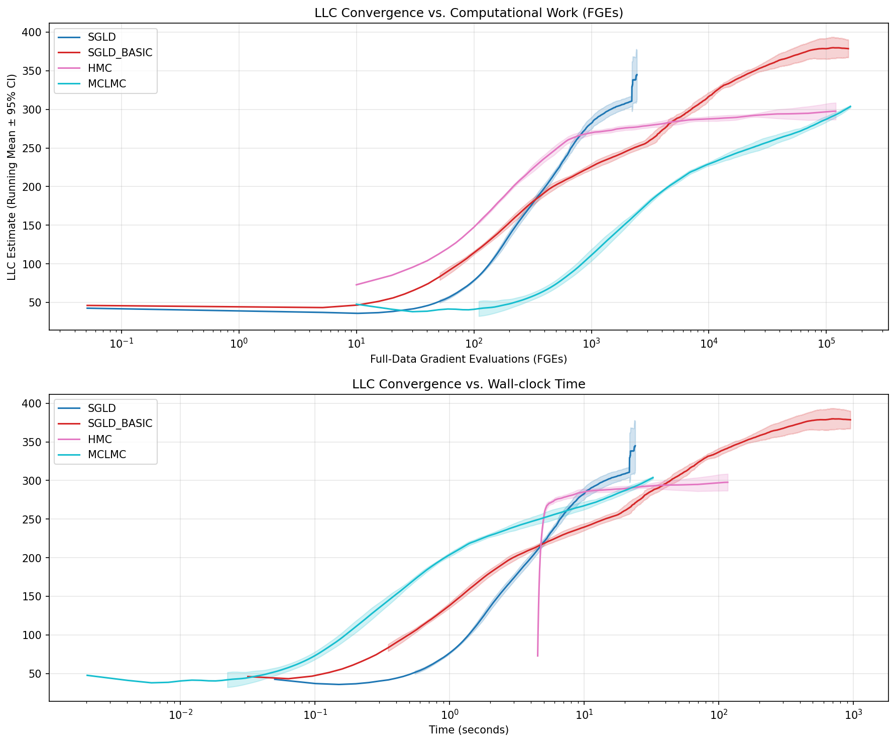

# `lambda_hat`: Local Learning Coefficient (LLC) Estimation

In [Singular Learning Theory (SLT)](https://singularlearningtheory.com), the **Local Learning Coefficient (LLC)** quantifies the effective local dimensionality of a model around a trained optimum.
Estimating it can be tricky. That is what we explore here.



This repo provides benchmark estimators of LLC on small but non-trivial neural networks, using standard industrial tooling:

* [BlackJAX](https://github.com/blackjax-devs/blackjax/tree/1.2.5) for sampling
* [ArviZ](https://python.arviz.org/) for diagnostics,
* [Hydra](https://hydra.cc/) for configuration management
* [Haiku](https://github.com/haiku/haiku) for neural network definitions.

We target networks with parameter-space dimension up to about $10^5$ which means we can ground-truth against classic samplers like HMC (which we expect to become non-viable as either dimension or cardinality of the dataset increases).
In this regime we can rely upon classic MCMC to tell us the “true” LLC rather than relying on analytic results for approximate networks such as Deep Linear Networks.

## Installation

Requires Python 3.11

```bash
# Using uv (recommended):
uv venv --python 3.12 && source .venv/bin/activate
uv sync --extra cpu   # For CPU/macOS
uv sync --extra cuda12  # For CUDA 12 (Linux)

# Or using pip:
pip install .[cpu]     # For CPU/macOS
pip install .[cuda12]  # For CUDA 12 (Linux)
```

Notes: On Intel macs, when running the command:

```bash
uv sync --extra cpu
```

You will encounter the error:

```bash
error: Distribution `jaxlib==0.7.1 @ registry+https://pypi.org/simple` can't be installed because it doesn't have a source distribution or wheel for the current platform

hint: You're on macOS (`macosx_15_0_x86_64`), but `jaxlib` (v0.7.1) only has wheels for the following platforms: `manylinux_2_27_x86_64`, `manylinux2014_aarch64`, `macosx_11_0_arm64`, `win_amd64`
```

The fix is to run the command:

```bash
uv pip  install "jax[cpu]"
```

Which will install a CPU only variant of JAX to your previously created UV managed venv. You'll see something like:

```bash
Resolved 6 packages in 2.24s
Prepared 6 packages in 28.68s
Installed 6 packages in 70ms
 + jax==0.4.38
 + jaxlib==0.4.38
 + ml-dtypes==0.5.4
 + numpy==2.3.5
 + opt-einsum==3.4.0
 + scipy==1.16.3
```

Notably, jaxlib version 0.4.38 is installed; the last version which supported intel macs. In my (Paul) best present assement—meaning whatever nonsense ChatGPT 5.1 produced—it seems unlikely that the requirement jaxlib >= 0.7.1 matters, and that jaxlib >= 0.4.38 will be fine. But, of course, stay tuned.

## Running Experiments

`lambda_hat` provides two entry points for running experiments. Configuration is managed by Hydra.

### Basic Usage

Run the default configuration (MLP target, all samplers):

```bash
# Console script (recommended)
uv run lambda-hat
```

Outputs (logs, plots, metrics) are automatically saved in a timestamped directory under `outputs/`.

### Using Configuration Presets

The configuration is composable. You can select presets defined in the `conf/` directory.

Run a quick, small experiment using the `fast` sampler settings and `small` model/data:

```bash
uv run lambda-hat sampler=fast model=small data=small
```

### Overriding Parameters

Override any configuration parameter from the command line:

```bash
# Change the dataset size and random seed
uv run lambda-hat data.n_data=5000 seed=123

# Change the model architecture
uv run lambda-hat model.depth=5 model.target_params=20000

# Adjust sampler settings
uv run lambda-hat sampler.hmc.draws=2000 sampler.sgld.step_size=1e-5
```

### Running Sweeps (Multi-Run)

Hydra allows running sweeps over parameters using the `--multirun` (or `-m`) flag.

```bash
# Sweep over different model sizes
uv run lambda-hat --multirun model.target_params=1000,5000,10000

# Compare base vs fast sampler settings
uv run lambda-hat --multirun sampler=base,fast
```

Combine sweeps (Cartesian product):

```bash
# 2 sizes x 2 sampler configs = 4 runs
uv run lambda-hat --multirun model.target_params=1000,5000 sampler=base,fast
```

Multi-run outputs are saved under `multirun/`.

## Documentation

- [Configuration Details](./docs/configuration.md)
- [Running on SLURM](./docs/parallelism.md)
- [BlackJAX Notes](./docs/blackjax.md)


## Background

* [[2308.12108] The Local Learning Coefficient: A Singularity-Aware Complexity Measure](https://arxiv.org/abs/2308.12108)
* [[2507.21449] From Global to Local: A Scalable Benchmark for Local Posterior Sampling](https://arxiv.org/abs/2507.21449)
* [singularlearningtheory.com](https://singularlearningtheory.com/)